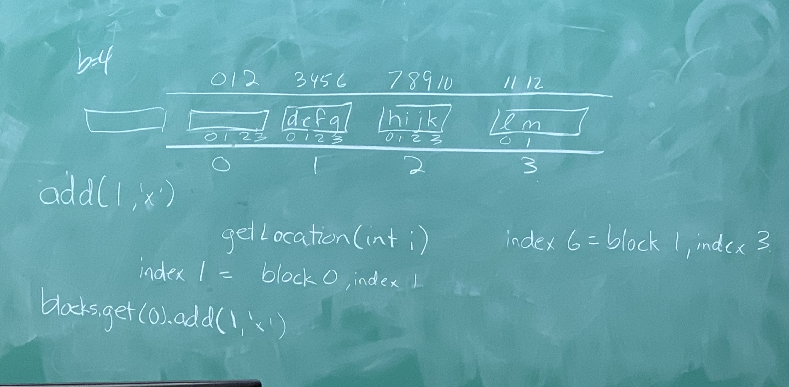
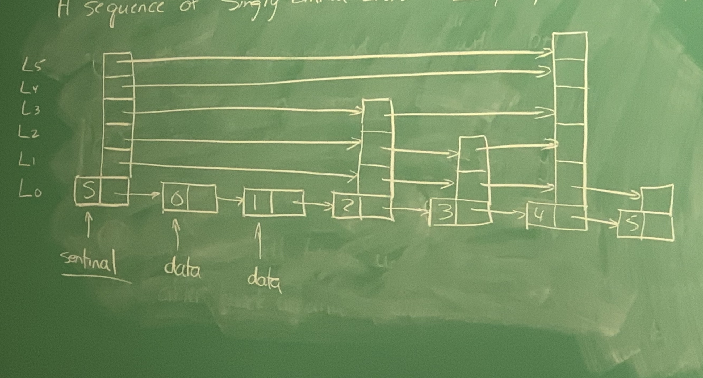
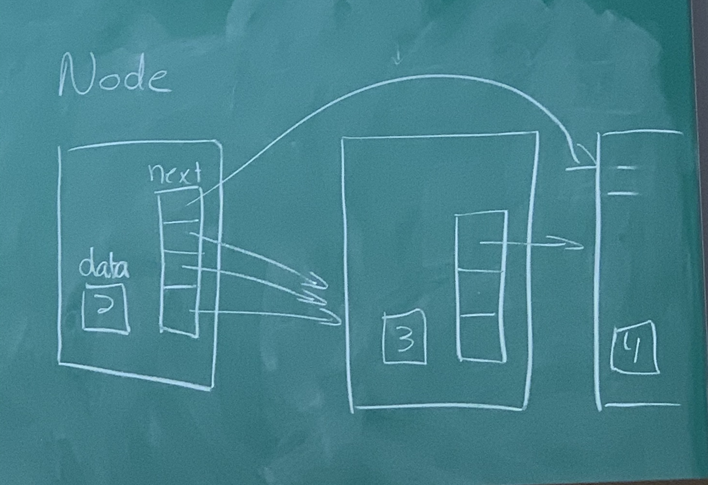

### Assignment help:
 - Darryl is explaining how the indexing for the ArrayDeque of ArrayDeques
 - 2 sets of indexes, internal indexes (inside the arrays) and external ones (that denote each array)


### SEList (cont. from one of the last lectures):
 - Recap: A Space Efficient List is a DoublyLinkedList with the data inside the nodes being stored as an ArrayDeque
 - Each block contains b-1, b, or b+1 items except the last block which has <=b+1
 - getLocation has a runtime of: O(min(i,n-i)/b)
 - get/set: O(min(i,n-i)/b)
 - add/remove: O(min(i,n-i)/b+b)

Claim: O(b) time spent in spread/gather for each call to add/remove
b = block size (size of the block inside each node)

 - if there's b+1 items inside a block that you're trying to add to, look b blocks to the "right" for an empty spot

### Cases:
 Adding at block $u_0$ and block $u_0$ is full
 1. within b steps, we find a block with less than b+1 items
  - shift item from $u_0 -> u_1 ... u_r-1 -> u_r$
 2. within <=b steps, we encounter the dummy node
  - Add a node before the dummy node, and shifr as in step 1
 3. in b steps, all blocks are full(they all have b+1) items
  - insert empty block after block $u_b$ and spread items into it so that each block has b items

### Proving the claim above:

With respect to add and spread:
 - a block is fragile if it has b+1 items

### What happens in each of the 3 cases mentioned above:
 1. we create at most 1 fragile block
 2. we create at most 1 fragile block
 3. we take away b fragile blocks on a call to spread
Explanation of how we get O(b)
 - if we start with an empty SEList with 0 fragile blocks (empty)
 - each call to add creates at most 1 fragile block
 - before the first call to spread, there were at least b calls to add
 - since each call to spread does precisely b(b+1)/2 move operations which is O(b^2)
 - amortized, this comes out to O(b) (since the b^2 only happens every b calls, so b^2/b=b)

### SkipList (implements SortedSet and List interfaces):
 - implement get,set,add,remove in O(log(n)) time, where n is the number of items in the SkipList
 - get/set: Array-based structures: O(1), LinkedLists: O(min(i,n-i))~O(n)
 - add/remove: Array-based structures and LinkedLists: O(min(i,n-i))~O(n)
  - if n=1 million, Array-based and lists would do 1 million operations, whereas a SkipList would do about 20 :exploding_head:
 - A SkipList is a sequence of singly-linked lists $L_0, L_1,..., L_h$ where h is the "height" of the SkipList

```java
class Node{
	T data;
	Node[] next;
	Node(T x, int h){
		data = x;
		next = new Node[h+1];
	}
}
```


 - to determine the height of a node, "flip a coin" and each time it's heads, increase the height by 1
 - to find node 3, start from the highest level of the sentinel node
   - if the node that we encounter is after the one we're looking for, go down a level in the sentinel node and try again
   - if the node we encounter is before the on we're looking for, go to it and then repeat the steps
   - repeat
