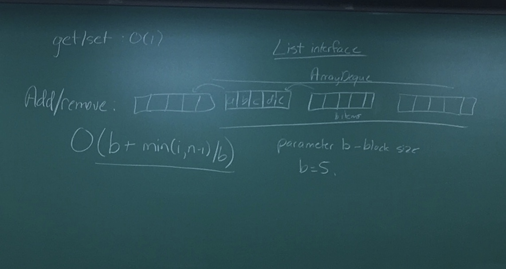
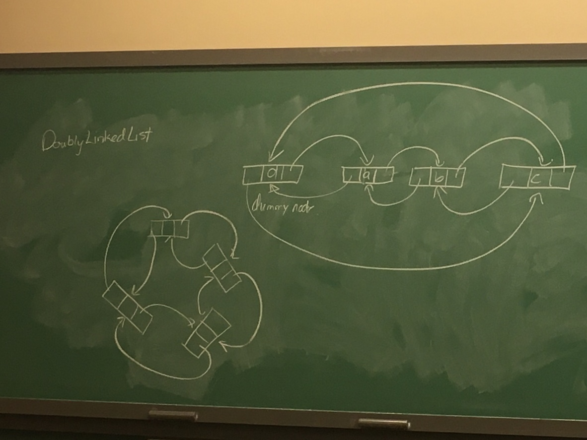

Assignment help:
 - add/remove efficiency: O(b+min(i,n-i)/b) // b = block size
 - get/set: O(i)


### Calls to rebalance(continued from last lecture):
 - just after the (i-1)th call to resize/rebalance, elements are divided evenly between the two arrays
 - just before ith call to resize/rebalance, the front(or back, it's arbitrary) has 1/4 of the total elements, the other side has 3/4
 - between these two calls, at least (ni)/2-1 add/remove operations
 - to rebalance, it takes 5ni/4 copy operations
 
### RootishArrayStack(continued):
 - other data structures have a lot of wasted space (up to 2n for n items) whereas this takes up n+√n space
 - implements the List interface and supports get/set in O(1), add/remove in O(n-i)
 - O(√n) wasted space is optimal for data structures that add items one at a time
 - wasted space is generally a trade-off between empty locations and pointers
 - if I have √n blocks, then I am wasting  >√n space with pointers
 - Let's say <√n blocks, at least one block must contain >√n items, so when this block is allocated, wasted space >√n

### SinglyLinkedLists:
 - Disatvantages:
   - lose O(1) get/set operations
 - Advavtages:
   - if we have access(reference) to the correct node, changes are fast

```java
public class Node {
	T data;
	Node next;
}

class SLList<T> implements Stack, Queue {
	Node head, tail;
	int n;
	
	SLList(){
		head=tail=null;
		n=0;
	}
	// recall that stacks have push and pop (which preform actions on the head of the list)
	// and thet queues have add (adds to the tail) and remove(removes from head)

	void push(T x){
		Node u = new Node(x);
		if(n==0){
			head = u;
			tail = u;
		}
		else{
			u.next = head;
			head = u; // if these 2 lines are reversed, you lose your whole list :wave:
		}
		n++;
	}
	T pop(){
		if(n==0){ return null; }
		T x = head.data;
		head = head.next;
		n--;
		if(n==0){ tail = null; }
		return x;
	}
	T remove(){
		return pop();
	}
	void add(T x){
		Node u;
		if(n==0){ push(x); }
		else{
			u = new Node(x);
			tail.next = u;
			tail = u;
			n++; // increment inside of else, since push() increments n on its own
		}
	}
}	
```

### Efficiency calculations:
 - push: O(1)
 - pop/remove: O(1)
 - add: O(1)

SinglyLiknkedLists are limited by not being able to remove things from the back quickly

### DoublyLinkedList
 - Darryl is drawing things on the board that are hard in Vim :cry:
 

```java
class DLList {
	int n;
	Node dummy;
	DLList(){
		dummy = new Node();
		dummy.next = dummy;
		dummy.prev = dummy;
	}
	Node getNode(int i){ // return node at index i
		// do some bounds checks (i in range between 0 and n-1)
		Node p = null;
		if(i<n/2) {
			p = dummy.next;
			for(int j=0; j<i; j++){
				p = p.next;
			}
		}
		else {
			p = dummy;
			for(int j=n; j>i; j--){
				p = p.previous; // since head.previous == tail
			}
		}
	return p;
	}
	
	T get(int i){
		return getNode(i).data;
	}
	T set(int i, T x){
		Node u = getNode(i);
		T y = u.data;
		u.data = x;
		return y;
	}
	Node addBefore(Node w, T x){
		Node u = new Node(x);
		u.prev = w.prev;
		u.next = w;
		w.prev = u;
		u.prev.next = u;
	}
```
