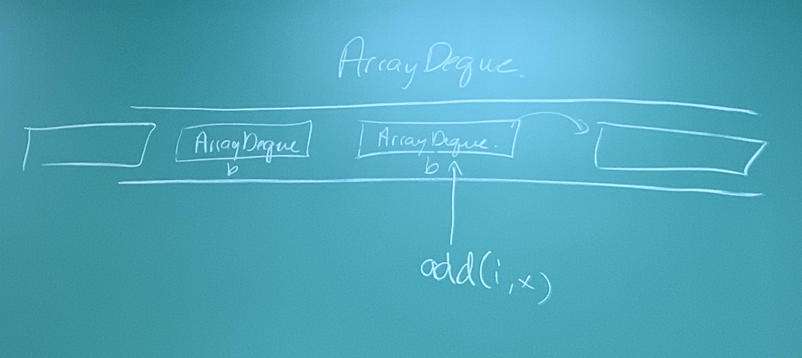
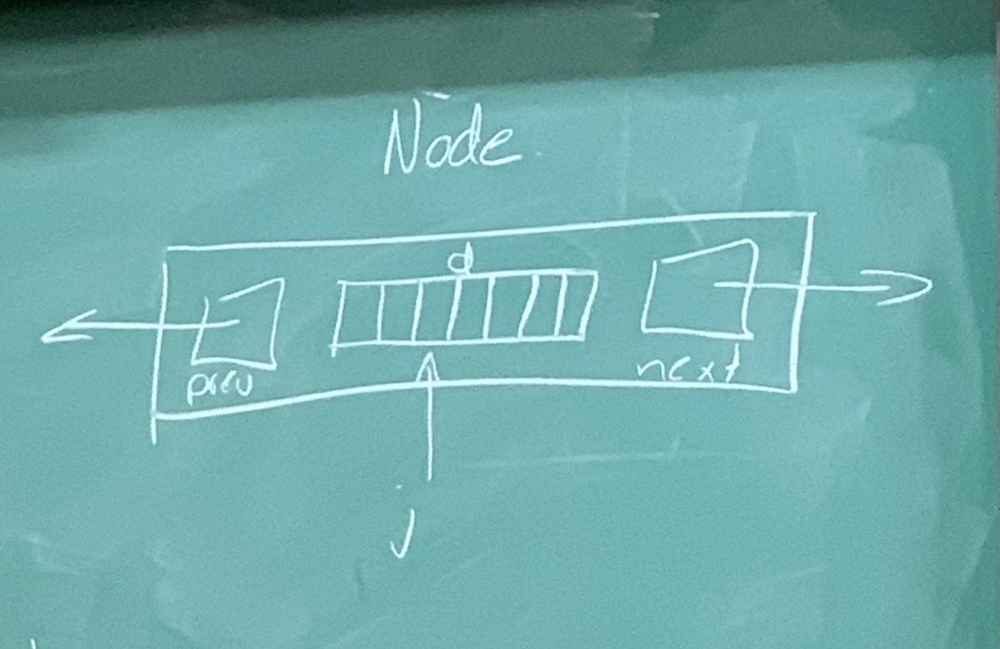

### Assignment hints:
 - use ArrayDeques
 - ArryaDeques in the middle always have 'b' items, and the ones on the edges can have less
 - shift elements to the side with less items; if you don't it will fail a time test

### Continuation from last lecture
```java
Node addBefore(Node w, T x){ // helper function for add
	Node u = new Node(x);
	// add code for splicing the node in
}

void remove(Node i){ // helper function for removing
	u.next.prev = u.prev;
	u.prev.next = u.next;
	n--; // decrement number of nodes
}
void add(int i, T x){
	addBefore(getNode(i), x);
}
T remove(int i){
	Node u = getNode(i);
	T y = u.data;
	remove(u);
	retrun y;
}

```

### Efficiency:
DoublyLinkedLists implement the List interface and this implementation supports get, set, add, and remove in O(min(i,n-i)) time
This implementation is not good in terms of wasted space, since there are 2 pointers for each node

### SEList (Space Efficient List):
 - divide data into blocks that contain several items each
 - block size is from b-1 to b+1 items (with the exception of the last block)
 - blocks are actually ArrayDeques, arranged like a dobuly linked list (that's circular)

```java
class BDeque extends ArrayDeque<T>{
	BDeque(){
		super();
		a = new Array(b+1);
	}
	void resize(){}
}

class Node {
	BDeque d;
	Node prev, next;
}
Node dummy;
int n;

```
If SEList contains n elements, there are at most n/(b-1) +1 = O(n/b)
At most O(1) wasted space per block, so total wasted space is O(b+n/b)
(b is block size)



```java
class Location{
	Node u;
	int j; // index within the ArrayDeque in u
}

Location getLocation(int i){
	// do some bounds checks here
	if(i<n/2){
		Node u = dummy.next;
		while(i>u.d.size()){ // search through the blocks, and keep going to the next block until you get to the one you need
			i -= u.d.size;
			u = u.next;
		}
		return new Location(u, i);
	} // for the assignment, we won't have a dummy node since we'll use an ArrayDeque, not a DLList
	else{
		Node u = dummy;
		int idx = n;
		while(i<idx){
			u = u.prev;
			idx -= u.d.size;
		}
		return new Location(u, i-idx);
	}
}
```

## Runtime:
 - reach the node in O(1+i/b) steps forward or O(1+(n-i)/b) steps backward
 - overall: O(min(i, n-i)/b)

```java
T get(int i){
	Location l = getLocation(i);
	return l.u.d.get(l.j); // so many dots... (it's not a joke, Darryl put this many dots)
}

T set(int i, T x){
	Location l = getLocation(i);
	return l.u.d.set(l.j, x);
}
```
### Runtime:
 - for both the get and set is again: O(min(i, n-i)/b) since it depends on the getLocation method

```java
boolean add(T x){
	Node last = dummy.prev;
	if(last == dummy || last.d.size() == b+1){
		last = addBefore(dummy); // put in an empty node before dummy(it's basically the same function as the one we wrote before)
	}
	last.d.add(x);
	n++;
	return true; // not necessary for this return, the function could easily be void
}
boolean add(int i, T x)

```

### Three cases for adding, where l.d is full:
 1. within b steps or less, we find a block that has room (ie less than b+1 items)
   - shift to make room in l.d
 2. within b steps or less, we encounter the dummy node (last block was full)
   - add a new block, then proceed as in case 1
 3. in b steps, all blocks are full
   - b blocks, each with b+1 items
   - add a block, and then spread the items so that there are b+1 block with b items in each
