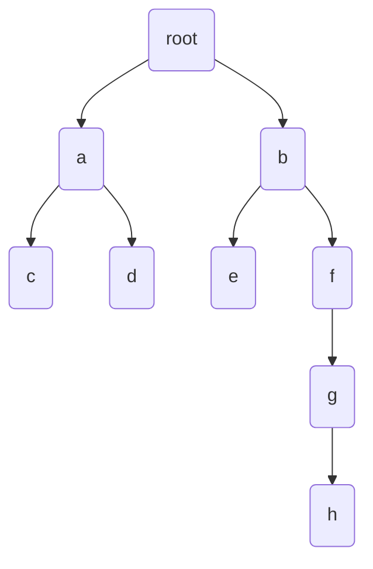

### HashTables and Linear probing
When do we resize?
 - add(x): if(2\*(q+1))\>t.length) resize()
 - remove(x): if(8\*n\<t.length) resize()
 ```java
void resize(){
	int d = 1;
	while(2^d<3*n)
		d++;
	t = new Array(2^d);
}
```
#### But why 8, 2, and 3?

 - d = 1 (size of HashTable is $2^d$)
 - n = q = 0 (q => non null elements)
 - hash function: x mod t.length
 - after add(39): n = q = 1 (d=1)
 - after add(63): n = q = 2 (d=2)
 - after add(15): n = q = 3 (d=3)
 - after add(47): n = q = 4 (d=3)
 - for each step, find d by solving: $2^d ≥ 3*n$

### Analysis
 - add   |
 - find  | - all three are O(1+size of run starting at hash(x))
 - remove|

#### Lemma:
The probability of a run of length k starting at i is $O(c^k)$ for a constant c, $0<c<1$
Since c is less than 1, this equation will grow slower and slower, meaning the probability of a longer run is smaller and smaller


Probability of 1 item landing in one of k locations is k/t.length
The probability of k out of q items landing in k consecutive locations starting at i,
and the other q-k items landing elsewhere is 


The expected length of a run at hash(x) is:


### Hash codes for Compound Objects
We have an object O made of parts $P_0, ... , P_(r-1)$ with hashcodes $x_0, ... , x_(r-1)$
We choose random w-bit odd integers $z_0, ... , z_(r-1)$ and one random 2w-bit integer z


## Binary Trees
 - the underlying structure of useful trees

 - basically a tall singly linked listed where each link links to more than 1 child



```java
class BTNode < Node Extends BTNode <Node>> {
  Node parent, left, right;
  // add data element by subclassing
}
```

 - The depth of a node is the length from the root to that node.

 - The height of a node 'a' is the length of the longest path from 'a' to a descendant of 'a'

 - Height of tree is the height of the root.

 - Node with no children is a leaf

 - BinaryTree is represented by the root

```java
int size(Node u){
  if (u == nil) return 0;
  return size(u.left) + size(u.right) + 1;
}

int height(Node u) {
  if (u == nil) return 0;
  return 1 + math.max(height(u.left), height(u.right))
}

void traverse(Node u) {
  id(u == nil) return
  traverse(u.left);
  traverse(u.righ);
}

void traverseIterative() {
  Node u = root, prev = nil, next;
  while(u !=nil) {
    if (prev = u.parent){
     if (u.left != nil) next = u.left;
     else if (u.right != nil) next = u.right;
     else next = u.parent;
    }
    else if (prev == u.left) {
      if (u.right != nil) next = u.right;
      else (next = u.parent);
    }
    else next = u.parent;
    prev = u;
    u = next;
  }
}
```
