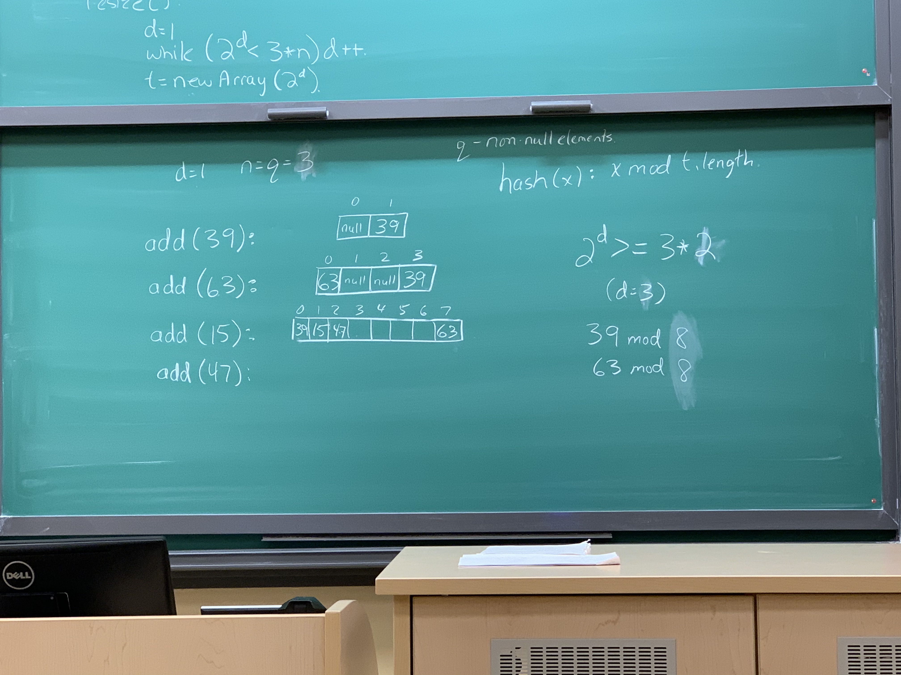
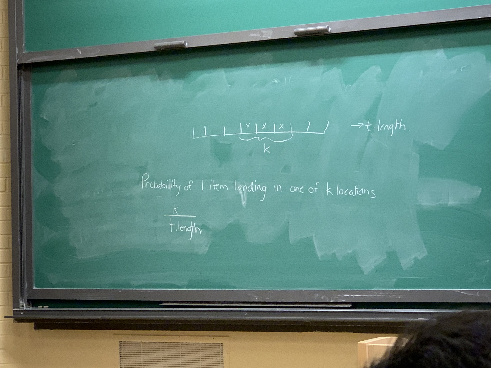
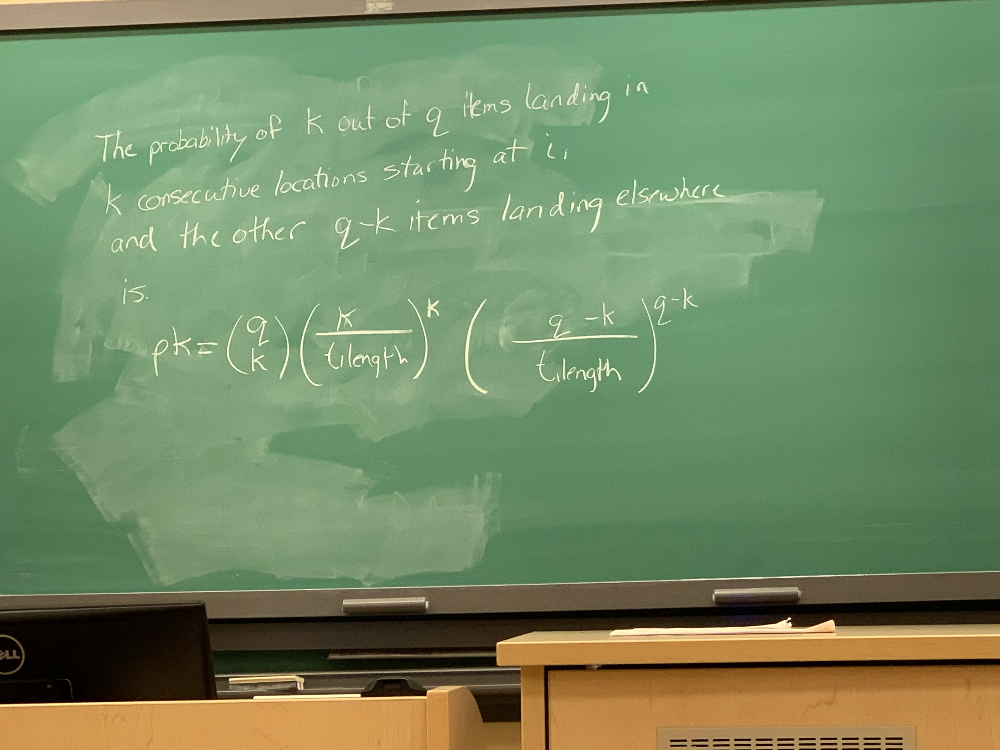
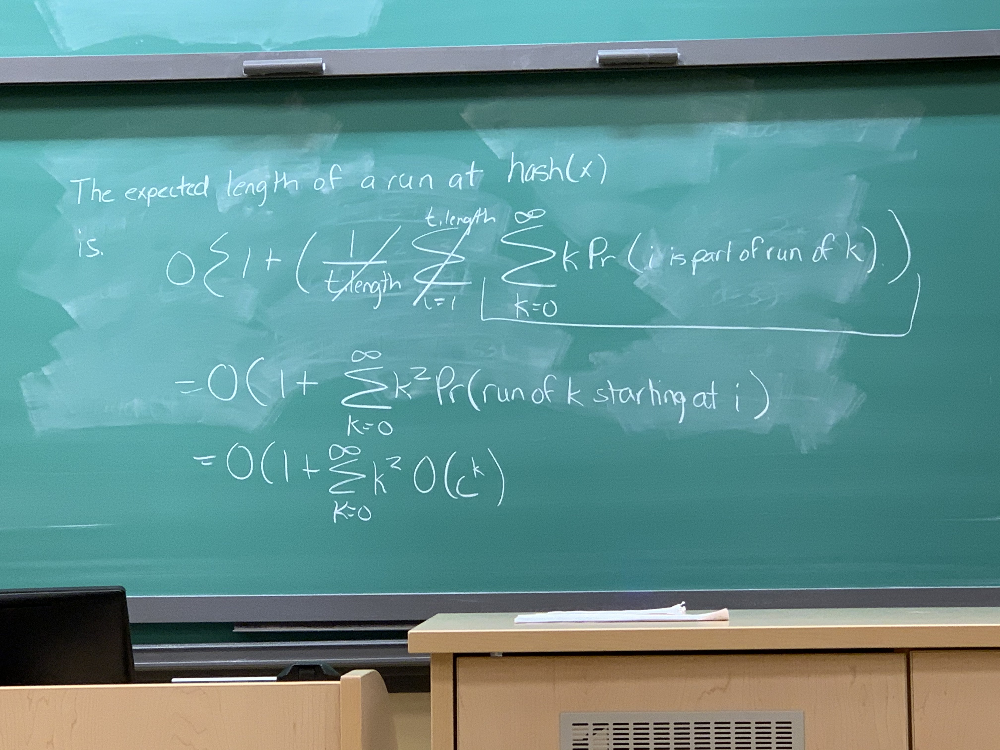
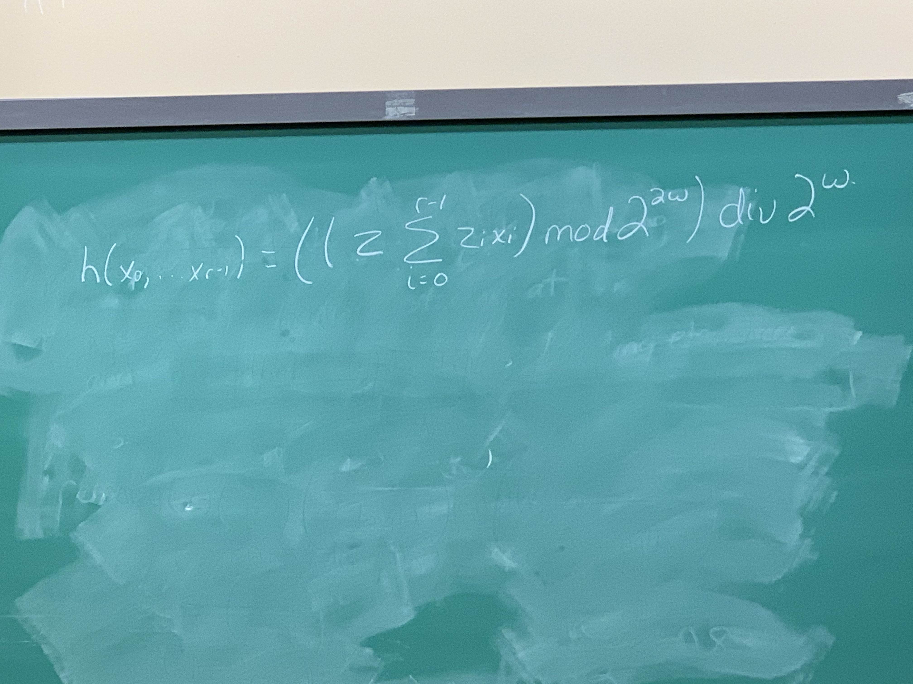

### HashTables and Linear probing
When do we resize?
 - add(x): if(2\*(q+1))\>t.length) resize()
 - remove(x): if(8\*n\<t.length) resize()
 ```java
void resize(){
	int d = 1;
	while(2^d<3*n)
		d++;
	t = new Array(2^d);
}
```
#### But why 8, 2, and 3?

 - d = 1 (size of HashTable is $2^d$)
 - n = q = 0 (q => non null elements)
 - hash function: x mod t.length
 - after add(39): n = q = 1 (d=1)
 - after add(63): n = q = 2 (d=2)
 - after add(15): n = q = 3 (d=3)
 - after add(47): n = q = 4 (d=3)
 - for each step, find d by solving: $2^d ≥ 3*n$

### Analysis
 - add   |
 - find  | - all three are O(1+size of run starting at hash(x))
 - remove|

#### Lemma:
The probability of a run of length k starting at i is $O(c^k)$ for a constant c, $0<c<1$
Since c is less than 1, this equation will grow slower and slower, meaning the probability of a longer run is smaller and smaller



Probability of 1 item landing in one of k locations is k/t.length
The probability of k out of q items landing in k consecutive locations starting at i,
and the other q-k items landing elsewhere is 



The expected length of a run at hash(x) is:



### Hash codes for Compound Objects
We have an object O made of parts $P_0, ... , P_(r-1)$ with hashcodes $x_0, ... , x_(r-1)$
We choose random w-bit odd integers $z_0, ... , z_(r-1)$ and one random 2w-bit integer z



## Binary Tree
 - underlying structure of useful trees
```java
class BTNode <Node extends BTNode <Node>>{
	Node parent, left, right;
	// add data element by subclassing
}
```
 - depth of a Node is the length from the root to that node
 - ancestors and decendants (self explanatory)
 - height of a Node 'a' is the length of the longest path from 'a' to any decendant of 'a'
 - height of a tree is the height of the root
 - a Node with no children (decendants) is a leaf
 - a BinaryTree is represented by the root
```java
int size(Node u){ // recursion works quite nicely here
	if(u==null){return 0;}
	return 1+size(u.left)+size(u.right);
}
```
```java
int height(Node u){
	if(u==null){return -1;} // since nodes that end with null have a height of 0s
	return 1 + Math.max(height(u.left), height(u.right));
}
```
 - recursion looks nice, but won't work with large trees(stack overflow error)
 - to avoid this, we implement iterative methods which are more complicated but use less memory
```java
void traverse(Node u){
	if(u==null){ return 0; }
	// processing step
	traverse(u.left);
	// processing step
	traverse(u.right);
	// processing step
}
```
```java
void traverse_iterative(){
	Node u=r, prev=null, next;
	while(u!=null){
		if(prev==u.parent){
			if(u.left!=null)
				next = u.left;
			else if(u.right!=null)
				next = u.right;
			else
				next = u.parent;
		}
		else if(prev==u.left){
			if(u.right!=null)
				next = u.right;
			else
				next = u.parent;
		}
		else{
			next = u.parent;
		}
		prev = u;
		u = next;
	}
	return count; // idk where this is defined or used, Darryl just put this at the end lol
}
```

