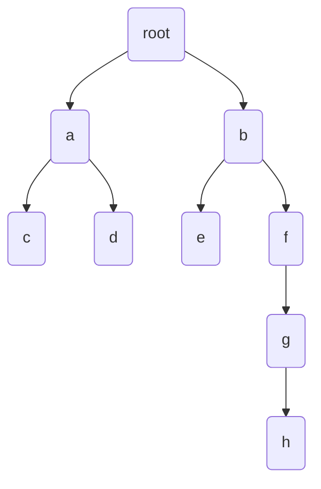

the underlying structure of useful trees

basically a tall singly linked listed where each link links to more than 1 child



```java
class BTNode < Node Extends BTNode <NOde>> {
  Node parent, left, right;
  // add data element by subclassing
}
```

The depth of a node is the length from the root to that node.
the height of a node a is the length of the longest path from a to a descendant of a

Height of tree is the height of the root.

Node with no children is a leaf

BinaryTree is represented by the root

```java
int size(Node u){
  if (u == nil) return 0;
  return size(u.left) + size(u.right) + 1;
}

int height(Node u) {
  if (u == nil) return 0;
  return 1 + math.max(height(u.left), height(u.right))
}

void traverse(Node u) {
  id(u == nil) return
  traverse(u.left);
  traverse(u.righ);
}

void traverseIterative() {
  Node u = root, prev = nil, next;
  while(u !=nil) {
    if (prev = u.parent){
     if (u.left != nil) next = u.left;
     else if (u.right != nil) next = u.right;
     else next = u.parent;
    }
    else if (prev == u.left) {
      if (u.right != nil) next = u.right;
      else (next = u.parent);
    }
    else next = u.parent;
    prev = u;
    u = next;
  }
}
```


